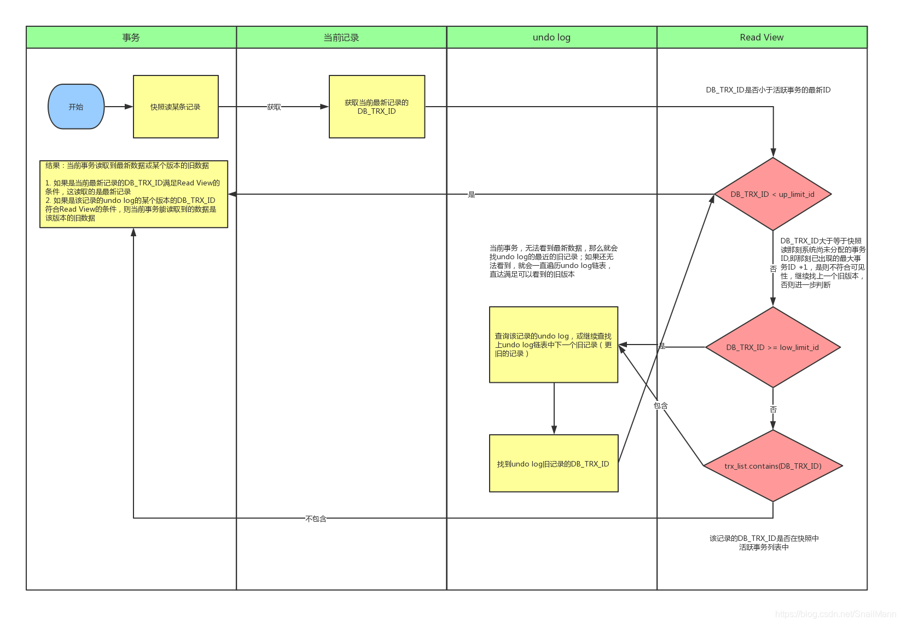

# MySQL

## 数据库的结构

页是MySQL中磁盘和内存交互的基本单位，也是MySQL管理存储空间的基本单位，
页的大小通常是16KB，可输入
`show variables like "innodb_page_size"`
查看当前设置页的大小

每个页中存放着我们的数据，即一行行的记录。MySQL中行记录的种类共有四种，分别是
`compact`,
`redundant`,
`dynamic`,
`compressed`,
可输入`show variables like "innodb_default_row_format"`
查看默认行格式

行记录由两个部分组成，分别是额外信息和真实数据，额外信息一般包括变长字段长度列表，NULL值列表和记录头信息，而真实数据则是记录中每个字段的值，加上三个隐藏列，分别为`DB_ROW_ID`,`DB_TRX_ID`,`DB_ROLL_PTR`
其中，如果用户定义了主键或是`unique`键，则MySQL不会默认生成`DB_ROW_ID`

当记录中的数据太多，一页无法存放下，会讲数据分散存储到其他页中，这种情况是**行溢出**

innodb有不同类型的页，存放记录行的页为**数据页**

每个数据页可以被分成七个部分：
+ File Header 表示页的一些通用信息
+ Page Header 表示数据页的一些专有信息
+ Infimum + Supremum 虚拟的最大记录和最小记录
+ User Records 存放记录
+ Free Space 还未使用的空间
+ Page Directory 记录各个槽的相对位置
+ File Trailer 用于检验页是否完整的部分

每个记录的头信息有一个`next_record`的属性，用于指向下一条记录，所有记录形成
单链表，Infimum的下一条记录为页中的第一条记录，而Supermum为最后一条记录。

为了加快查询记录的速度，将数据页的记录分成不同的组，每组最后一个记录的地址偏移量作为一个槽，进行查询时，
先通过二分法查找该记录所在的槽，再遍历槽中的记录

每个数据页的File Header部分都有上一个和下一个页的编号，所以所有的数据页会组成一个**双链表**。

## 数据库单表的查询方法

**MySQL**单表的查询方法可以分为两种,通过计算不同查询方法的成本，优化器选择成本最低的方法，然后操作存储引擎查询数据

+ 使用全表扫描进行查询
+ 使用索引进行查询
    + 主键和唯一二级索引的等值查询
    + 普通二级索引的等值查询
    + 索引的范围查询
    + 遍历索引

具体的访问方法如下：
+ const 
    通过主键或者唯一的二级索引定位一条记录的方法
+ ref
    通过二级索引进行等值查询的方法，可能会匹配到多条记录，因为索引的不唯一性
+ ref_or_null
    在ref的基础上，还要查找等于null的记录
+ range
    通过索引进行进行范围匹配的方法
+ index
    通过遍历索引来查询记录的方法，适用于不能直接通过索引进行查询，但是查询的列包含于索引列
+ all
    全表扫描，直接扫描聚簇索引

## Buffer Pool

### Buffer pool的构成

为了加快数据库的访问，通过`Buffer Pool`将经常访问的页存放在内存中，减少读取磁盘的次数，提高效率

`Buffer Pool`由控制块和缓存页组成,每个缓存页对应一个控制块，
控制块里存有该页的相关信息，
通过`FREE`链表连接起未使用空闲页的控制块，
通过`FLUSH`链表连接起修改后的脏页的控制块,
通过`LRU`链表实现无空闲页后页的替换策略,
后台线程会每隔一段时间，将`LRU`链表的`old`区域的一部分页面和`FLUSH`中的一些页刷新回磁盘

通过为`Buffer Pool`的数据页建立哈希索引来快速确定当前页是否存放在`Buffer Pool`

### LRU链表

`LRU`链表分为两个部分，一部分是`young`区域，存放着经常访问的数据页的控制块，
一部分是`old`区域，存放访问频率不高的数据页的控制块。

具体的换页策略如下：
当`Buffer Pool`内无空闲页时，先将该页加入`old`区域，如果在一定时刻内被访问，则不会将该页移动到`young`区域，该参数为`innodb_old_blocks_time`,否则将该页移动到`young`区域，而对于`young`区域的节点，当再次被访问，并且处于`young`区域的后四分之一时，才会将该节点移动至`young`区域头部。

## redo log

为了减少从磁盘读取数据页的时间开销，通过将数据页缓存在`Buffer Pool`中，减少对磁盘的访问
但是如果`Buffer Pool`的数据页经过了修改后，还没有被同步到磁盘上,
此时如果出现崩溃或者断电的情况，会导致数据的丢失。

为了能够从意外情况中恢复数据,通过`redo log` 记录下每次对数据库的修改，
当出现数据意外丢失的情况后，根据`redo log`，重做对数据库的修改，就能将数据库恢复到丢失前的情况。

为了解决写入磁盘过慢的问题，`redo log`记录在`redo log buffer`上，`redo log buffer` 分为不同的`block`,每次顺序写入，
当前`block`写满后，就往下一个`block`写日志,
`read log buffer`中的`buf_next_to_write`的变量来标记接下来要写入磁盘日志文件的位置，
`buf_free`变量来标记接下来写入`read log buffer`的位置,
`flushed_to_disk_lsn`变量来来标记接下来要写入磁盘日志文件的位置

在一些情况下，会将内存中的`redo log`刷新到磁盘上的`redo log`文件,比如`redo log buffer`空间不足或事务提交时。
`redo log`文件由若干个大小为512字节的`block`组成

### LSN

`Log Sequence Number`即日志序列号，用来记录写入的日志

#### LSN in flush

`flush`链表维护脏页的节点，每个节点维护两个有关`LSN`的变量，分别是
`oldest_modification`和`newest_modification`，
`oldest_modification`存储该页第一次被修改时，即成为脏页时的`LSN`值，
当该页加入`flush`链表后，接下来每次对该页的修改，只会更新`newest_modification`的值为当前的`LSN`,
所以`oldest_modification`存储着最初对该页的修改所产生`redo log`的`LSN`,
`newest_modification`存储着最新的对该页的修改所产生`redo log`的`LSN`。
每次向`flush`链表增加节点，都是从头部插入，所以头部存储的是最晚修改的数据页，
尾部存储的是最早修改的数据页。

#### checkpoint

因为写入`redo log`文件是采用循环的方式，当写到文件结束，会回到文件开始继续写入，
所以需要判断当前日志能否被重写，对于一部分`redo log`，它所对应修改的数据页，
已经被刷新到磁盘了，即使崩溃，也不会导致数据丢失，这部分`redo log`保存的必要，
所以可以被重用。

通过维护`checkpoint_lsn`来表示当前日志文件中可以被覆盖的日志总量,
检查当前`flush`链表中尾部节点的`oldest_modification`，
所有`lsn`小于改值的`redo log`对应的脏页已经被刷新回磁盘了，
将该值赋给`checkpoint_lsn`，在此之前的`redo log`都可以被重用

## 数据库的索引

### 1.数据库的三大范式
> + 第一范式：确保每列保持原子性，数据表中的所有字段值都是不可分解的原子值
> + 第二范式：确保表中的每列都和主键相关
> + 第三范式：确保每列都和主键列直接相关而不是间接相关

### 2.索引的优缺点
+ 优点
    + 大大加快数据检索的速度
    + 将随机I/O变成顺序I/O(因为B+树的叶子节点是连接在一起的)
    + 加速表与表之间的连接
+ 缺点
    + 从空间角度考虑，建立索引需要占用物理空间
    + 从时间角度考虑，创建和维护索引都需要花费时间，例如对数据进行增删改的时候都需要维护索引。

### 3.Hash索引和B+树索引
+ 哈希索引不支持排序，因为哈希表是无序的
+ 哈希索引不支持范围查找
+ 哈希索引不支持模糊查询及多列索引的最左前缀匹配
+ 因为哈希表中会存在哈希冲突，所以哈希索引的性能是不稳定的，而B+树索引的性能是相对稳定的，每次查询都是从根节点到叶子节点

### 4.什么是聚簇索引？什么是非聚簇索引
+ 聚簇索引将数据和索引放到一起存储，索引结构的叶子节点保存数据行
+ 非聚簇索引将数据和索引分开存储，索引结构的叶子节点保存指向数据行的地址

### 5.什么是回表
通过非聚簇索引查找所需记录的主键值，再根据这个主键值到聚簇索引中查找完整的记录。

### 6.什么是联合索引?
同时以多个列的大小作为排序规则，也就是为多个列建立索引。

### 7.建立索引的代价
1. 空间代价：每建立一个索引都要生成一棵B+树，B+树每个节点都是一个数据页，一个数据页默认占用16KB空间
2. 时间代价：B+树每层节点都是根据索引值的大小进行排序，每次对表中的数据进行增，删，改时，都可能要调整B+树中节点的分布

### 8.索引适用的条件
1. 全值匹配：搜索条件中的列和索引列一致
2. 最左匹配：搜索条件中的列和索引列最左边的一致
3. 字符串前缀匹配
4. 范围查找，但是如果对多个列进行范围查找时，只能对最左边的列进行查找时，才会用到索引
5. 精确匹配和范围查找某一列
6. 排序
7. 分组

### 9.什么是索引覆盖?
只需在一棵索引树上搜索，就能获取查找的所有信息，无需回表

### 10.如何挑选索引?
1. 索引列的类型尽量小，查询时，比较速度快，存储时，占用空间小
2. 为用于搜索，排序，分组的列建立索引
3. 为重复值小的列建立索引，提高搜索效率

### 11.join buffer的作用
存储驱动表的结果，每一条被驱动表的记录一次性和join buffer的驱动表记录匹配，显著减少被驱动表的I/O代价

## 数据库的事务

### 1.什么是数据库的事务?

> 数据库事务是一系列数据库操作，这些操作要么全部执行,要么全部不执行，是一个不可分割的工作单位。

### 2.事物的四大特性

+ 原子性：原子性是指包含事务的操作要么全部执行成功，要么全部失败回滚
+ 一致性：一致性指事务在执行前后状态是一致的
+ 隔离性：一个事务所进行的修改在最终提交之前，对其他事务是不可见的
+ 持久性：数据一旦提交，其所作的修改将永久地保存到数据库中

### 3.数据库的并发一致性问题

+ 脏读：事务A更新了数据，但还没有提交，这时事务B读取到事务A更新后的数据，然后事务A回滚了，事务B读取到的数据就成为脏数据了
+ 不可重复读：事务A对数据进行多次读取，事务B在事务A多次读取的过程中执行了更新操作并提交了，导致事务A多次读取到的数据并不一致
+ 幻读：事务A在读取数据后，事务B向事务A读取的数据中插入了几条数据，事务A再次读取数据时发现多了几条数据，和之前读取的数据不一致
+ 丢失修改：事务A和事务B都对同一个数据进行修改，事务A先修改，事务B随后修改，事务B的修改覆盖了事务A的修改

### 4.数据库的隔离级别

MySQL的默认隔离级别是可重复读
+ 未提交读：一个事务在提交前，它的修改对其他事务也是可见的
+ 提交读：一个事务提交之后，它的修改才能被其他事务看到
+ 可重复读：在同一个事务中多次读取到的数据是一致的
+ 串行化：需要加锁实现，会强制事务串行执行

### 5.丢失更新分类

1. 提交：事务A修改了字段A的数据并提交，事务B修改了字段A的数据并提交，导致事务A的更新没有了。
2. 回滚：事务A修改了字段A的数据并提交，事务B修改了字段A的数据并回滚，导致事务A的更新没有了。

### 6.丢失更新解决方案

### 7.什么是当前读和快照读

+ 当前读：像`select lock in share mode`，`select for update`，`update`，
`insert`，`delete`这些操作都是当前读，当前读表示读取的是记录的最新版本，
读取时还要保证其他并发事务不能修改此事务，会对读取的记录加锁

+ 快照读：像**不加锁**的`select`操作都是快照读，即不加锁的**非阻塞**读；
快照读的前提是隔离级别不是串行级别，如果在串行级别下，快照读退化为当前读。
快照读的实现基于`MVCC`，即多版本并发控制。因为是多版本，所以在快照读的情况下，
不一定读到记录的最新版本，可能是之前的历史版本。

### 8.什么是悲观锁

> 悲观锁：悲观锁指的是采用一种消极悲观的态度，默认数据被外界访问时，
必然会产生冲突，所以在数据处理的整个过程中都采用加锁的状态，
保证同一时间，只有一个线程可以访问到数据，实现数据的排他性。
通常，数据库的悲观锁利用数据库本身提供的锁机制去实现。
数据库的悲观锁可以解决读写冲突和写写冲突，指在用加锁的方式去解决。

**悲观锁的实现**：
+ 外界要访问某条数据，首先向数据库申请该数据的锁
+ 如果成功，就可以操作该数据，在此期间，其他客户端不能操作该数据
+ 如果失败，则表明已有客户端获取该数据的锁，需要等待该客户端释放锁

> 优点：适合在写多读少的并发环境中使用，虽然无法维持非常高的性能，但是在乐观锁无法提更好的性能前提下，可以做到数据的安全性

> 缺点：加锁会增加系统开销，虽然能保证数据的安全，但数据处理吞吐量低，不适合在读书写少的场合下使用

### 8.什么是乐观锁

> 乐观锁：乐观锁是相对悲观锁而言，乐观锁是假设认为即使在并发环境中，
外界对数据的操作一般是不会造成冲突，所以并不会去加锁(所以乐观锁不是一把锁)，
而是在数据进行提交更新的时候，才会正式对数据的冲突与否进行检测，
如果发现冲突了，则让返回冲突信息，让用户决定如何去做下一步，比如说重试，
直至成功为止；数据库的乐观锁，并不是利用数据库本身的锁去实现的，
可能是利用某种实现逻辑去实现做到乐观锁的思想。
数据库的乐观并发控制要解决的是数据库并发场景下的写-写冲突，指在用无锁的方式去解决。

**乐观锁的实现**：
+ 使用数据版本实现
+ 使用时间戳实现

[相关资料](https://blog.csdn.net/SnailMann/article/details/88388829)

> 优点：在读多写少的并发场景下，可以避免数据库加锁的开销，提高响应性能

 > 缺点：在写多读少的并发场景下，即在写操作竞争激烈的情况下，
会导致CAS多次重试，冲突频率过高，导致开销比悲观锁更高

### 9.什么是CAS原理

> `CAS`的全称是`Compare and Swap`。
`CAS`的操作包含三个操作数，需要读取的内存位置(V)，预期原值(A)，新值(B)。
如果内存位置的值与预期原值的A相匹配，那么将内存位置的值更新为新值B。
如果不匹配，那么不做任何操作。无论哪种情况，都会在该操作前返回该位置的值。

### 10.数据库的并发场景

+ 读读：不存在任何问题，不需要并发控制
+ 读写：有线程安全问题，可能会造成事务隔离性问题，可能会遇到脏读，幻读，不可重复读
+ 写写：有线程安全问题，可能会存在丢失更新问题，比如第一类丢失更新，第二类丢失更新

### 11.MVCC的流程

图片转载自[https://www.cnblogs.com/xuwc/p/13873611.html](https://www.cnblogs.com/xuwc/p/13873611.html)

